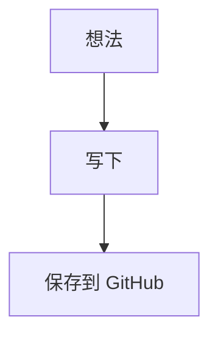

# 简记 Markdown

简记是一个给手机用的 Markdown 写作和阅读器。

它的目标很简单：打开就能写，切过去就能看。常用 Markdown 符号放在键盘旁边，不用在手机输入法里反复找 `##`、代码块、表格、公式这些符号。

## 适合做什么

- 写日记、读书笔记、课程笔记、灵感草稿
- 在手机上查看 Markdown 文档
- 离线保存本地草稿
- 渲染 LaTeX 数学公式
- 渲染 Mermaid 图表
- 通过 GitHub 仓库管理自己的笔记文件

## 功能

- Markdown 写作和预览
- 手机底部快捷工具栏
- 加粗、斜体、标题、引用、列表、任务、链接、分隔线
- 表格插入、增行、删行、增列、删列
- 代码块和行内代码
- KaTeX 数学公式渲染
- Mermaid 图表渲染
- GitHub 拉取和上传 Markdown 文件
- 离线优先，主要资源都在本地

## GitHub 笔记仓库

你可以把 GitHub 当成自己的 Markdown 笔记仓库。

在应用右上角打开 GitHub 设置，只需要填：

- `Token`
- `GitHub 地址`

GitHub 地址填仓库主页即可，例如：

```text
https://github.com/你的用户名/你的仓库名
```

拉取时，应用会自动读取仓库里的 Markdown 文件，然后让你选择要打开哪一篇。

上传时，应用会让你选择覆盖已有文件，或者输入一个新文件名来创建新笔记。

Token 只保存在当前设备本地。简记没有后端服务器，也不会把 Token 发给除 GitHub API 以外的地方。

## 获取 GitHub Token

推荐使用 Fine-grained personal access token。

打开 GitHub 后按这个路径：

```text
头像 -> Settings -> Developer settings -> Personal access tokens -> Fine-grained tokens
```

然后点 `Generate new token`。

建议这样配置：

- `Token name`：随便写，比如 `Jianji Markdown`
- `Expiration`：按自己习惯选择有效期
- `Repository access`：选择 `Only select repositories`
- 勾选你准备用来存笔记的仓库

权限里找到 `Repository permissions`，至少开启：

```text
Contents: Read and write
```

如果你只是管理普通 `.md` 笔记，这一个权限通常就够了。

如果你要编辑 `.github/workflows` 里的文件，还需要额外开启：

```text
Workflows: Read and write
```

生成后复制 Token，填到简记的 GitHub 设置里。

GitHub 官方文档：

- [Managing your personal access tokens](https://docs.github.com/en/authentication/keeping-your-account-and-data-secure/managing-your-personal-access-tokens)
- [Permissions required for fine-grained personal access tokens](https://docs.github.com/en/rest/overview/permissions-required-for-fine-grained-personal-access-tokens)

## 上传 403 怎么办

如果上传时出现 `403`，通常是 Token 权限不够。

优先检查：

- Token 是否选择了当前仓库
- `Contents` 是否是 `Read and write`
- 你是否对这个仓库有写入权限
- Token 是否过期
- 仓库默认分支是否开启了保护规则

公开仓库读取可以不填 Token，但上传一定需要有写权限的 Token。

## 数学公式

行内公式：

```markdown
$E = mc^2$
```

公式块：

```markdown
$$
\int_0^1 x^2 dx = \frac{1}{3}
$$
```

## Mermaid

````markdown

````

## Android APK

可以直接安装 Release 里的 APK：

```text
https://github.com/cfn0324/jianji-markdown/releases
```

本地重新打包：

```bash
npm run android:build
```

生成的安装包在项目根目录：

```text
JianjiMarkdown-debug.apk
```

## 本地运行

安装依赖：

```bash
npm install
```

启动本地预览：

```bash
npm run serve
```

然后打开：

```text
http://127.0.0.1:4173
```

## 离线说明

简记的 Markdown、KaTeX、Mermaid 等核心资源都放在本地，APK 可以离线使用。

如果用浏览器版本，直接打开 `index.html` 也能写作和预览；如果想使用 PWA 缓存，需要通过 HTTPS 或设备本机 `localhost` 访问。

## 一句话

简记不是一个复杂的知识库系统。

它只是想让你在手机上更容易写 Markdown，更舒服地看 Markdown，然后把重要的笔记安静地放回自己的 GitHub 仓库里。
